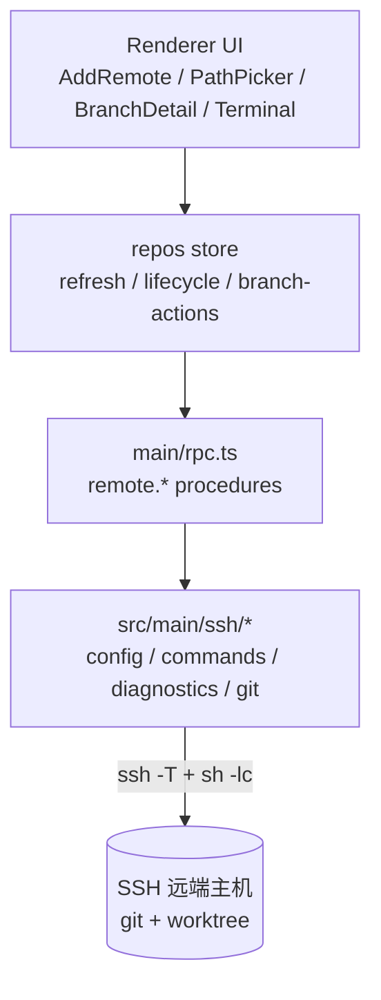
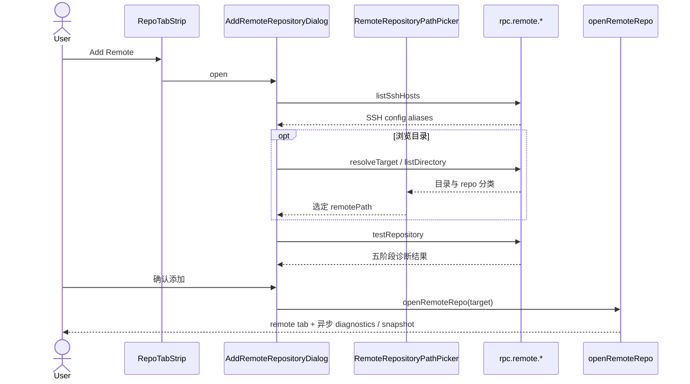
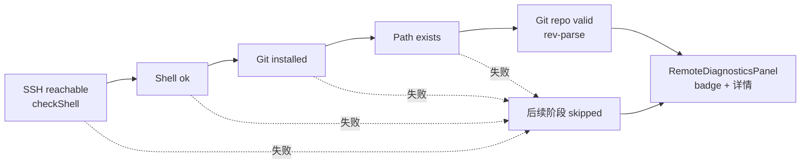
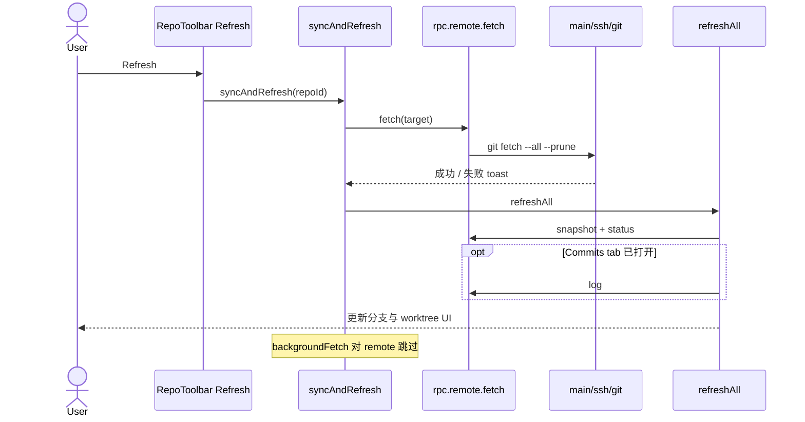
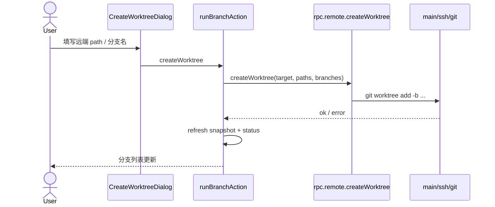
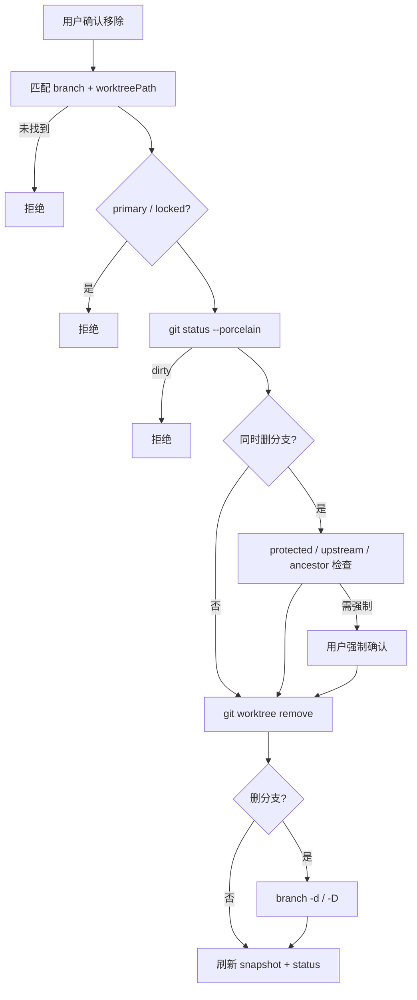
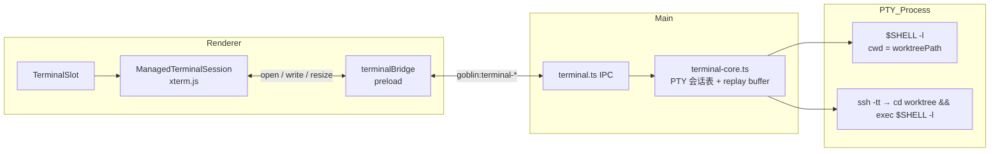
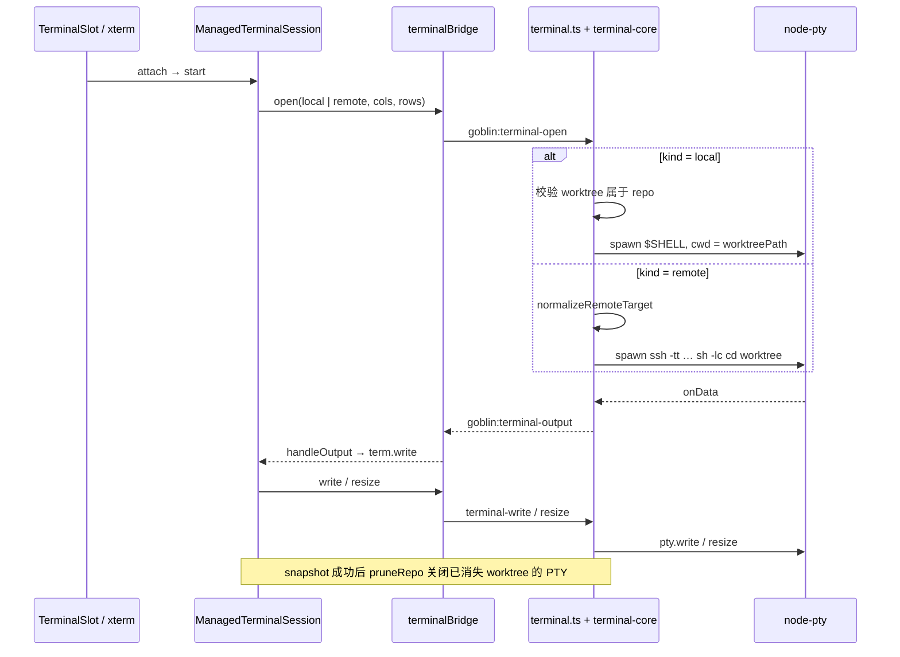
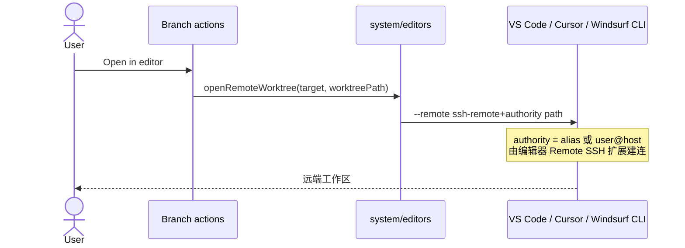

# SSH Remote 功能实现方案

本文总结当前 `feat/ssh` 分支中 SSH remote repository 的实现。它描述的是当前代码已经采用的方案，不是后续待办计划。

## 目标

Goblin 支持把远端 SSH 主机上的 Git 仓库作为一类仓库打开和管理。仓库仍然保留在远端主机上，Goblin 不会在本地 clone 或缓存一份副本。

实现后的核心能力：

- 通过 SSH config host 或手动输入 `host/user/port` 添加远端仓库。
- 支持可选 SSH 私钥路径，只保存路径，不保存密钥内容或 passphrase。
- 添加前执行分阶段诊断：SSH、shell、Git、路径、Git repo。
- 浏览远端目录并识别 Git 仓库目录。
- 读取远端分支快照、worktree 信息、dirty 状态和提交日志。
- 手动刷新时在远端执行 `git fetch --all --prune`，然后刷新快照/状态/日志。
- 创建远端 worktree。
- 打开远端 worktree 的内嵌终端。
- 用 VS Code/Cursor/Windsurf 的 Remote SSH 能力打开远端 worktree。
- 安全移除远端 worktree，并可选删除对应分支。

## 非目标

- 不实现远端密码登录表单。
- 不收集、不保存 SSH passphrase。
- 不保存私钥内容。
- 不暴露任意远端 shell 命令 RPC。
- 不把远端仓库物化为本地路径。
- 不为 remote repository 执行后台自动 fetch。
- 不为 remote repository 支持 checkout/pull/push/GitHub PR 等本地仓库动作。

## 总体架构

实现沿用现有仓库状态模型，通过 `RepoState.kind` 区分本地和远端：

```ts
type RepoKind = 'local' | 'remote'
```

本地仓库的 `RepoState.id` 仍然是本地绝对路径；远端仓库的 `RepoState.id` 是规范化后的 SSH 仓库 ID：

```text
ssh://<user>@<host>:<port>/<remotePath>
```

远端仓库的连接信息保存在 `remoteTarget`：

```ts
interface RemoteRepoTarget {
  id: string
  alias: string | null
  host: string
  user: string
  port: number
  remotePath: string
  identityFile?: string
  displayName: string
}
```

分层职责：

| 层 | 主要职责 | 关键文件 |
| --- | --- | --- |
| shared model | 远端目标建模、标准化、RPC 类型 | `src/shared/remote-repo.ts`, `src/shared/rpc.ts` |
| main SSH | SSH config 解析、命令构造、诊断、远端 Git 操作 | `src/main/ssh/*.ts` |
| main RPC | 暴露受控 `remote.*` procedure，做边界校验 | `src/main/rpc.ts` |
| renderer store | 将现有 snapshot/status/log/fetch/branchAction 资源路由到远端 RPC | `src/renderer/stores/repos/*.ts` |
| renderer UI | 添加 remote、诊断、目录选择、刷新、worktree、终端和编辑器入口 | `src/renderer/components/*.tsx` |
| terminal | 将终端输入扩展为 local/remote discriminated union | `src/shared/terminal.ts`, `src/main/terminal.ts`, `src/renderer/components/terminal/*` |

## 操作交互图

以下 Mermaid 图概括主要用户操作与组件之间的交互；各图后的章节有更完整的文字说明。

### 分层与远端读写路径



### 添加远端仓库



### 远端诊断



### 手动刷新



### 创建远端 worktree



### 移除远端 worktree



### 内嵌终端（本地与远端）

终端统一为 **Renderer xterm.js + Main node-pty**；远端仅在 PTY 中执行 `ssh -tt`，不在 renderer 内直连 SSH。





### 打开远端编辑器



## 添加远端仓库流程

入口在 tab strip 的 `+` 菜单中，新增 `Add Remote`：

1. `RepoTabStrip` 触发 `AddRemoteRepositoryDialog`。
2. dialog 加载 `rpc.remote.listSshHosts()`，读取 `~/.ssh/config` 中的 concrete host alias。
3. 用户选择连接模式：
   - SSH config 模式：输入 `alias + remotePath + identityFile?`。
   - manual 模式：输入 `host + user + port? + remotePath + identityFile?`。
4. 用户可以通过文件选择器调用 `rpc.remote.identityFileDialog()` 选择私钥路径。
5. 用户可以先 resolve target，再通过 `RemoteRepositoryPathPicker` 浏览远端目录。
6. `rpc.remote.resolveTarget()` 返回标准化 `RemoteRepoTarget`。
7. `rpc.remote.testRepository()` 执行诊断。
8. 用户确认后调用 `openRemoteRepo(target)` 加入 store。

`openRemoteRepo` 的行为：

- 不调用本地 `repo.probe`。
- 不写入 recent local repos。
- 如果仓库已打开，只激活现有 tab，不重复添加。
- 新增时创建 `kind: 'remote'` 的 `RepoState`。
- 打开后异步启动 remote diagnostics 和 remote snapshot。

## SSH 连接解析

`src/main/ssh/config.ts` 负责连接输入到 `RemoteRepoTarget` 的解析。

SSH config 模式：

- `listSshConfigHosts()` 读取 `~/.ssh/config`。
- `parseSshConfigHosts()` 提取 `Host`、`HostName`、`User`、`Port`。
- 忽略 wildcard alias、`!` alias 和重复 alias。
- `resolveRemoteTarget()` 使用 `ssh -G <alias>` 得到有效 `hostname/user/port`。
- 没有配置 user 时使用当前系统用户。

manual 模式：

- 直接使用用户输入的 `host/user/port`。
- 未填写 port 时默认 `22`。

两种模式都会通过 `normalizeRemoteTarget()` 做最终校验：

- `host`、`user` 必须是非空安全字符串。
- `port` 必须是 `1..65535` 的整数。
- `remotePath` 必须是远端绝对路径，且不含 `\0`。
- `identityFile` 允许为空；非空时只做安全字符串校验。

## SSH 私钥路径处理

`identityFile` 是连接元数据，不参与 repo id 计算。

这样设计有两个效果：

- 同一个远端仓库换私钥路径后，仍然被识别为同一个 remote repository。
- session 可以保存私钥路径，但不会保存任何 secret 内容。

命令构造时：

- `identityFile` 存在时添加 `-i <identityFile>`。
- `~` 和 `~/...` 会在 main 进程展开到当前用户 home。
- 不强制 `BatchMode=yes` 或 `NumberOfPasswordPrompts=0`，让 OpenSSH、ssh-agent 或系统 keychain 处理加密私钥。

## 远端命令构造

所有远端命令都通过 `src/main/ssh/commands.ts` 中的受控枚举构造：

```ts
type RemoteCommandKind =
  | { type: 'checkShell' }
  | { type: 'checkGit' }
  | { type: 'testDirectory'; path: string }
  | { type: 'revParseTopLevel'; path: string }
  | { type: 'listDirectories'; path: string; limit?: number }
  | { type: 'gitSnapshot'; path: string }
  | { type: 'gitFetch'; path: string }
  | { type: 'gitWorktreeList'; path: string }
  | { type: 'gitStatus'; path: string }
  | { type: 'gitLog'; path: string; branch: string; count?: number; skip?: number }
  | { type: 'gitWorktreeAdd'; path: string; worktreePath: string; newBranch: string; baseBranch: string }
  | { type: 'gitWorktreeRemove'; path: string; worktreePath: string }
  | { type: 'gitBranchDelete'; path: string; branch: string; force?: boolean }
  | { type: 'gitUpstream'; path: string; branch: string }
  | { type: 'gitIsAncestor'; path: string; ancestor: string; descendant: string }
```

renderer 不拼 SSH 命令，也没有 `remote.command` 这类任意命令 RPC。

非交互命令的 SSH 参数：

- `ssh -T`
- `RequestTTY=no`
- `StrictHostKeyChecking=yes`
- `ConnectTimeout=10`
- manual target 使用 `user@host` 和 `-p <port>`。
- alias target 使用 alias 作为 destination，不额外传 `-p`。
- 远端脚本通过 `sh -lc <quoted script>` 执行。

命令执行使用 `execa`：

- 默认超时 `15s`。
- worktree 写操作超时 `180s`。
- 支持 `AbortSignal` 取消。
- stdout/stderr 统一映射为 `RemoteCommandResult`。

## 远端诊断

`src/main/ssh/diagnostics.ts` 的诊断是顺序执行的五阶段检查：

| 阶段 | 命令 | 失败分类 |
| --- | --- | --- |
| SSH reachable | `checkShell` | auth failed、host key、unreachable、timeout、cancelled、shell failed |
| Shell available | 检查 stdout 是否为 `ok` | shell failed |
| Git installed | `command -v git` | git missing |
| Path exists | `test -d <remotePath>` | path missing |
| Git repository valid | `git rev-parse --show-toplevel` | not a repo |

一旦某阶段失败，后续阶段标记为 `skipped`。renderer 的 `RemoteDiagnosticsPanel` 按阶段显示 badge、失败分类和可展开细节。

## 远端目录浏览

`src/main/ssh/path-picker.ts` 提供两类能力：

- `home`: 执行 `printf "$HOME"`，失败时 fallback 为 `/`。
- `listDirectory`: 执行 `find <path> -mindepth 1 -maxdepth 1 -type d`，最多返回 200 条。

每个子目录会再用 `git rev-parse --show-toplevel` 分类：

- `repo`: 该目录就是 Git repo root。
- `in repo`: 该目录位于某个 Git repo 内。
- `folder`: 普通目录。
- `unreadable`: 权限错误或不可访问。

renderer 只允许选择 `repo` 或 `in repo` 目录作为仓库路径。

## 远端 Git 快照、状态和日志

远端 Git 行为集中在 `src/main/ssh/git.ts`。

### Snapshot

`getRemoteSnapshot(target)` 并行执行：

- `gitSnapshot`: 读取 current branch、default branch、所有 local branches。
- `gitWorktreeList`: 读取 `git worktree list --porcelain`。

随后对每个非 bare worktree 执行 `git status --porcelain -z`，并把 dirty 状态和 change count 合并进 branch 数据。

最终返回现有 renderer 已支持的形状：

```ts
interface RemoteRepoSnapshot {
  branches: BranchInfo[]
  current: string
}
```

### Status

`getRemoteStatus(target)`：

1. 读取所有 worktree。
2. 过滤 bare worktree。
3. 对每个 worktree 执行 `git status --porcelain -z`。
4. 返回现有 `WorktreeStatus[]` 结构。

远端 status path 是远端绝对路径，renderer 不把它当成本地路径校验。

### Log

`getRemoteLog(target, branch, count, skip)`：

- 通过 `git -C <repo> log` 读取提交。
- `count` 限制在 `1..1000`。
- `skip` 最小为 `0`。
- 输出格式沿用现有 `FIELD_SEP`，复用 `parseLog()`。

renderer 的分页逻辑继续使用现有 `INITIAL_LOG_COUNT`、`LOG_PAGE_SIZE`、`MAX_LOG_COUNT`。

## 远端 fetch 和刷新

手动刷新 remote repository 时：

1. renderer 调用 `syncAndRefresh(id)`。
2. remote repo 走 `rpc.remote.fetch({ target })`。
3. main 进程执行 `git -C <remotePath> fetch --all --prune`。
4. fetch 成功或失败都通过现有 repo event/toast 通道反馈。
5. 非取消、非并发占用结果会继续执行 `refreshAll()`。
6. `refreshAll()` 刷新 remote snapshot 和 remote status；如果当前打开 Commits tab，再刷新 log。

后台 fetch 保持 local-only。`backgroundFetch()` 对 `repo.kind === 'remote'` 直接跳过，避免在用户未明确触发时连接远端 SSH 主机。

## 远端 worktree 创建

UI 复用 `CreateWorktreeDialog`。

对 remote repository：

- 默认 path 由 `defaultRemoteWorktreePath(remotePath, branch)` 生成。
- 规则是远端 repo path 后追加分支 slug，例如：
  - repo: `/srv/goblin`
  - branch: `feature/x`
  - 默认 worktree: `/srv/goblin-feature-x`
- 用户自定义 path 必须是远端绝对路径，且不含 `\0`。
- 不做本地 `~` 展开或本地文件系统校验。

提交后：

1. renderer 执行 `runBranchAction(kind: 'createWorktree')`。
2. remote repo 路由到 `rpc.remote.createWorktree()`。
3. main 校验远端 path 和 branch name。
4. 执行：

```sh
git -C <repo> worktree add -b <newBranch> -- <worktreePath> <baseBranch>
```

5. 成功后刷新 remote snapshot 和 status。

## 远端 worktree 移除

当前实现支持安全移除非 primary remote worktree，并可选删除对应分支。

执行顺序：

1. `git worktree list --porcelain` 找到与 `branch + worktreePath` 同时匹配的 worktree。
2. 拒绝以下情况：
   - 找不到匹配 worktree。
   - primary/main worktree。
   - locked worktree。
3. 对目标 worktree 执行 `git status --porcelain -z`。
4. 如果 status 失败或有改动，拒绝移除，避免删除脏 worktree。
5. 如果用户选择同时删除分支：
   - protected branch 直接拒绝。
   - 非强制时检查 upstream 和 `merge-base --is-ancestor`。
   - 如果不能证明安全删除，返回需要强制确认的错误。
6. 执行：

```sh
git -C <repo> worktree remove -- <worktreePath>
```

7. 如果同时删除分支，再执行：

```sh
git -C <repo> branch -d -- <branch>
```

强制确认后使用 `branch -D`。

UI 上，remote branch 只在有 worktree 且不是 primary worktree 时显示移除入口。

## 远端终端

内嵌终端的完整交互见上文 [内嵌终端（本地与远端）](#内嵌终端本地与远端)。

终端输入模型扩展为 local/remote discriminated union：

```ts
type TerminalOpenInput =
  | { kind?: 'local'; repoRoot: string; branch: string; worktreePath: string; terminalId: string; cols: number; rows: number }
  | { kind: 'remote'; target: RemoteRepoTarget; branch: string; worktreePath: string; terminalId: string; cols: number; rows: number }
```

remote terminal 行为：

- renderer 的 `TerminalSlot` 使用 `{ kind: 'remote', repoId, target, branch, worktreePath }` 作为 base。
- session group key 包含 `remote + repoId + worktreePath`。
- main 进程校验 `RemoteRepoTarget`、branch、remote absolute path、terminal id、size。
- main 进程启动本地 PTY，但 PTY command 是 `ssh -tt ...`。
- 远端启动脚本：

```sh
cd <remoteWorktreePath> && exec "${SHELL:-/bin/sh}" -l
```

这保证内嵌终端直接进入被选中的远端 worktree。

snapshot 刷新后会按当前远端 worktree path prune terminal sessions，避免已经不存在的 worktree 继续保留对应 terminal group。

## 远端编辑器打开

当前支持 VS Code、Cursor、Windsurf 这类 VS Code-family 编辑器。

main 进程通过各编辑器 `.app` bundle 内的 CLI 打开：

```text
<editor-cli> --remote ssh-remote+<authority> <remotePath>
```

authority 规则：

- SSH config target 使用 `alias`。
- manual target 使用 `user@host`。

这依赖编辑器自身 Remote SSH 扩展/能力处理连接。Goblin 不在这里建立编辑器专用 SSH 会话。

## Renderer 状态和资源生命周期

remote repository 复用现有 repo resource，而不是新增一套独立状态：

- `resources.diagnostics`: SSH 诊断。
- `resources.fetch`: 手动远端 fetch。
- `resources.snapshot`: 分支/worktree 快照。
- `resources.status`: worktree status。
- `resources.logsByBranch`: commit log。
- `resources.branchAction`: create/remove worktree。

关键点：

- UI loading、busy、disabled、error、stale 仍从 `repo.resources` 推导。
- 不引入 `repo.ops`。
- 并发控制仍在 `runtime.ts` / `operation-runner.ts`。
- remote snapshot/status/log 在 `refresh.ts` 中按 `repo.kind` 路由到 `rpc.remote.*`。
- remote repo 不刷新 pull requests；相关 workflow 会跳过 remote。
- remote repo 不写入本地 repo cache，避免把远端路径数据当成本地仓库缓存。

## 会话持久化

session 保存从原来的本地路径数组扩展为 typed entries：

```ts
type RepoSessionEntry =
  | { kind: 'local'; id: string }
  | { kind: 'remote'; id: string; target: RemoteRepoTarget }
```

持久化行为：

- local repo 保存本地绝对路径。
- remote repo 保存标准化 target。
- 启动恢复时，local repo 会重新 probe 本地路径。
- remote repo 不做本地 probe，直接恢复为 remote tab，并异步刷新 diagnostics 和 snapshot。
- malformed remote entry 会被丢弃。
- active repo 只有存在于恢复后的 open repos 中才保留。

## UI 表现

Tab strip：

- remote repo 使用 server 图标。
- 显示 `remote` badge。
- title/subtitle 使用 `user@host:remotePath`。
- diagnostics 失败时 summary 会携带失败分类。

Repo toolbar：

- `Refresh`: 对 remote 执行手动 fetch + refresh。
- `New worktree`: remote target 存在时可用。
- `Retry`: 只对 remote 显示，用于重新运行 diagnostics。

Branch detail：

- Status、Changes、Commits 对 remote 可用。
- Terminal tab 在 branch 有 remote worktree path 时可用。
- checkout/pull/push/GitHub 本地动作对 remote 隐藏。
- remote branch 有 worktree 时可打开远端编辑器。
- remote branch 有非 primary worktree 时可移除 worktree。
- copy patch 仍是 local-only。

## 安全边界

当前实现的安全边界如下：

- 不保存密码、passphrase、private key 内容。
- `identityFile` 只保存路径，且不参与 repo id。
- 不暴露任意远端命令 RPC。
- 远端命令由固定 `RemoteCommandKind` 构造。
- 远端路径和 branch 参数都经过校验并 shell quote。
- SSH 使用 `StrictHostKeyChecking=yes`。
- 诊断、fetch、Git 操作支持取消和超时。
- 背景 fetch 不连接 remote repository。
- 移除 remote worktree 前必须确认目标 worktree、确认非 primary、确认非 locked、确认 clean。
- 删除远端分支前会检查 protected branch 和 upstream ancestor；不安全时需要强制确认。

## 关键测试覆盖

当前分支已有针对 remote 功能的测试覆盖：

| 文件 | 覆盖点 |
| --- | --- |
| `src/shared/remote-repo.test.ts` | target 标准化、id 稳定性、secret-like 字段剔除、identityFile 保留 |
| `src/main/ssh/config.test.ts` | SSH config/manual target 解析和 identityFile 传递 |
| `src/main/ssh/commands.test.ts` | SSH argv、shell quoting、identityFile、fetch/status/log/worktree/terminal 命令 |
| `src/main/ssh/diagnostics.test.ts` | 诊断阶段和失败分类 |
| `src/main/ssh/path-picker.test.ts` | home/listDirectory 和目录分类 |
| `src/main/ssh/git.test.ts` | snapshot/status/log/fetch/create/remove worktree |
| `src/main/rpc.test.ts` | remote router 边界校验、无 raw command procedure |
| `src/main/settings.test.ts` | typed session entries 和 remote session 归一化 |
| `src/main/system/editors.test.ts` | Remote SSH editor CLI 参数 |
| `src/main/terminal.test.ts` | remote terminal open/restart/prune |
| `src/renderer/components/AddRemoteRepositoryDialog*.test.tsx` | 添加 remote dialog、私钥选择和 connection input 构造 |
| `src/renderer/stores/repos/*.test.ts` | open/hydrate remote repo、remote refresh/status/log、remote branch actions |
| `src/renderer/components/terminal/*.test.ts` | remote terminal key/session payload |

## 当前实现边界和后续可考虑项

当前实现已经能覆盖 remote repository 的主要读写闭环：添加、诊断、浏览、刷新、读状态、读日志、创建 worktree、打开终端、打开编辑器、移除 worktree。

后续如果继续扩展，应优先单独设计这些能力的安全边界：

- remote checkout/pull/push。
- remote branch delete without worktree removal。
- remote patch/copy patch。
- remote GitHub/PR 关联。
- 更细粒度的远端诊断错误翻译。
- 支持非 VS Code-family 编辑器的 remote 打开方式。

这些能力涉及更强的远端写操作或第三方集成，不应直接复用本地路径假设。
